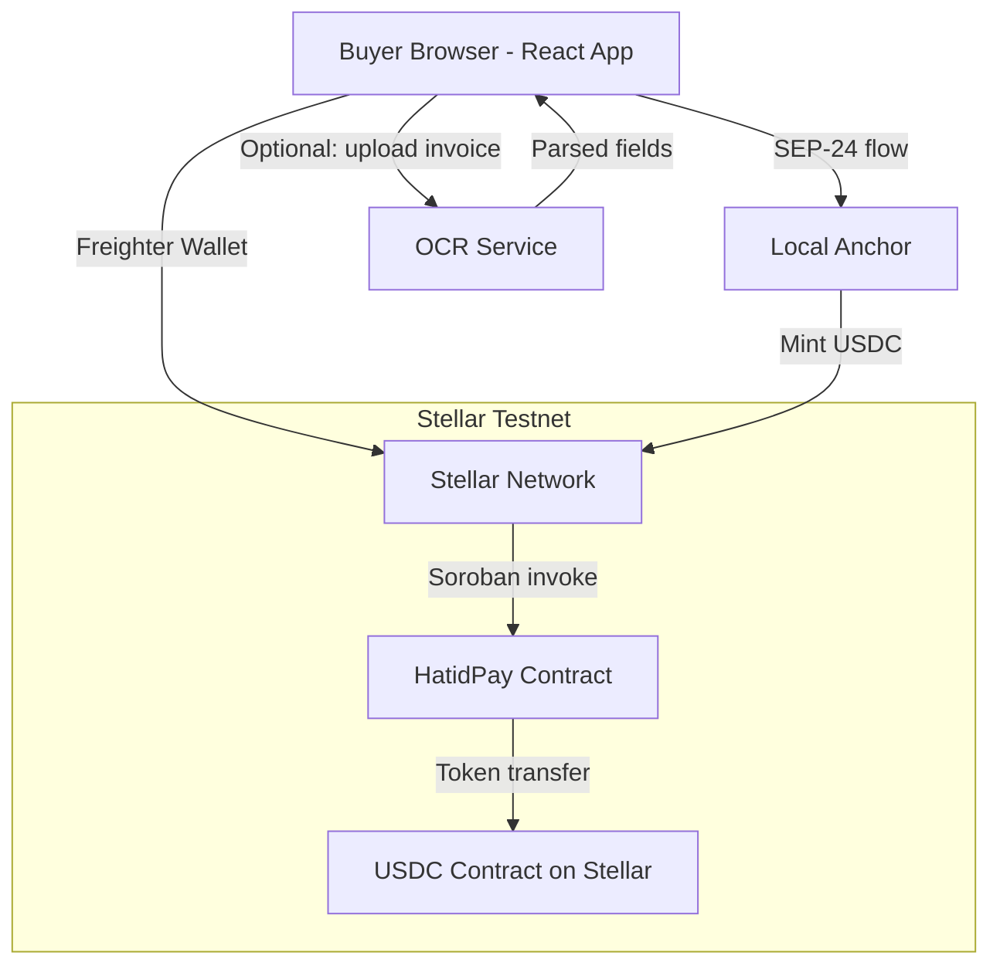

# Design Document — HatidPay

## Overview

HatidPay is a mobile-first web application that enables Filipino SME buyers to pay overseas suppliers using USDC on the Stellar network via a Soroban smart contract escrow. The system has three layers:

1. **Soroban Smart Contract** — on-chain escrow logic (already scaffolded in `contracts/`)
2. **React Frontend** — mobile-first UI for wallet connection, escrow creation, and status tracking
3. **Optional OCR Service** — invoice parsing to auto-populate escrow fields

The MVP flow is: PHP deposit via anchor → USDC in wallet → create escrow → supplier ships → buyer confirms → USDC released. All on Stellar testnet for the demo.

---

## Architecture



**Key design decisions:**
- No backend server for the MVP. All state lives on-chain. The frontend talks directly to Stellar RPC.
- Freighter wallet handles key management and transaction signing — no seed phrases in the app.
- Stellar's native token contract (SEP-41) handles USDC transfers; the escrow contract holds funds between parties.
- The anchor integration is a guided flow (link out or iframe) — not a full SEP-24 implementation in the MVP.

---

## Components and Interfaces

### 1. Soroban Smart Contract (`contracts/src/lib.rs`)

Already implemented. Exposes five functions:

| Function | Caller | Description |
|---|---|---|
| `create_escrow(buyer, supplier, token, amount, deadline)` | Buyer | Locks USDC, returns escrow ID |
| `confirm_delivery(escrow_id)` | Buyer | Releases USDC to supplier |
| `claim_expired(escrow_id)` | Supplier | Claims funds after deadline passes |
| `raise_dispute(escrow_id, caller)` | Buyer or Supplier | Freezes escrow |
| `get_escrow(escrow_id)` | Anyone | Read-only escrow state |

Contract emits events on each state change: `escrow/created`, `escrow/confirm`, `escrow/expired`, `escrow/dispute`.

### 2. React Frontend (`frontend/`)

**Tech stack:**
- React 18 + TypeScript
- Vite (build tool)
- Tailwind CSS (mobile-first styling)
- `@stellar/freighter-api` (wallet connection)
- `@stellar/stellar-sdk` (Stellar RPC, transaction building)
- React Query (async state / RPC calls)

**Page structure:**

```
/                   → Landing / Connect Wallet
/dashboard          → Escrow list (buyer's active escrows)
/escrow/new         → Create escrow form
/escrow/:id         → Escrow detail + actions (confirm, dispute)
/onramp             → PHP → USDC anchor guide
```

**Key components:**

| Component | Responsibility |
|---|---|
| `WalletConnect` | Freighter connection, displays address + USDC balance |
| `EscrowForm` | Supplier address, amount, deadline inputs + trustline check |
| `EscrowCard` | Status badge, amount, deadline countdown, action buttons |
| `EscrowDetail` | Full escrow view with confirm/dispute/claim actions |
| `OnrampGuide` | Step-by-step anchor deposit instructions |
| `InvoiceUpload` | (Optional) File upload + OCR result display |

### 3. Stellar Integration Layer (`frontend/src/lib/stellar.ts`)

Thin wrapper around `stellar-sdk` and `freighter-api`:

```typescript
// Key functions exposed:
connectWallet(): Promise<string>                          // returns public key
getUSDCBalance(address: string): Promise<string>
checkTrustline(address: string, assetCode: string): Promise<boolean>
createEscrow(params: CreateEscrowParams): Promise<string> // returns escrow ID
confirmDelivery(escrowId: string): Promise<void>
claimExpired(escrowId: string): Promise<void>
raiseDispute(escrowId: string): Promise<void>
getEscrow(escrowId: string): Promise<EscrowData>
```

All contract invocations build a Soroban transaction, sign via Freighter, and submit to Stellar RPC.

### 4. OCR Service (Optional, `ocr-service/`)

A lightweight Python service (FastAPI) that accepts an image or PDF upload and returns parsed invoice fields.

```
POST /parse-invoice
  Body: multipart/form-data { file: File }
  Response: { supplier_address?, amount_usd, items: string[], confidence: float }
```

Uses `pytesseract` for OCR and an LLM call (OpenAI or local) for structured extraction. Deployed separately; frontend calls it only if the user uploads a file.

---

## Data Models

### On-chain (Soroban contract types)

```rust
pub struct Escrow {
    pub buyer: Address,
    pub supplier: Address,
    pub token: Address,
    pub amount: i128,       // smallest unit (7 decimals for USDC)
    pub deadline: u64,      // unix timestamp
    pub status: EscrowStatus,
}

pub enum EscrowStatus { Created, Confirmed, Expired, Disputed }
```

### Frontend types (`frontend/src/types/index.ts`)

```typescript
interface EscrowData {
  id: string;
  buyer: string;
  supplier: string;
  token: string;
  amount: string;        // formatted USDC (e.g. "50.00")
  amountRaw: bigint;     // raw i128
  deadline: Date;
  status: 'Created' | 'Confirmed' | 'Expired' | 'Disputed';
}

interface CreateEscrowParams {
  supplierAddress: string;
  amountUSDC: number;
  deadlineHours: number; // converted to unix timestamp on submit
  tokenAddress: string;  // USDC contract address (testnet constant)
}
```

### Config constants (`frontend/src/lib/config.ts`)

```typescript
export const STELLAR_RPC_URL = 'https://soroban-testnet.stellar.org';
export const NETWORK_PASSPHRASE = Networks.TESTNET;
export const USDC_CONTRACT_ADDRESS = '<testnet USDC address>';
export const HATIDPAY_CONTRACT_ADDRESS = '<deployed contract ID>';
export const DEFAULT_DEADLINE_HOURS = 72;
```

---

## Error Handling

### Contract errors (mapped from `Error` enum)

| Code | Enum | Frontend message |
|---|---|---|
| 1 | `NotFound` | "Escrow not found. Check the ID and try again." |
| 2 | `Unauthorized` | "You're not authorized to perform this action." |
| 3 | `AlreadySettled` | "This escrow has already been settled." |
| 4 | `NotExpired` | "The delivery window hasn't closed yet." |
| 5 | `InvalidAmount` | "Amount must be greater than zero." |

### Frontend error boundaries

- Wallet not connected → redirect to `/` with connect prompt
- Freighter not installed → show install link
- Insufficient USDC balance → disable "Pay & Escrow" button, show balance
- Supplier trustline missing → inline warning on `EscrowForm`, block submission
- RPC timeout / network error → toast notification with retry option
- OCR low confidence → show raw text, allow manual correction

### Transaction lifecycle states

Each contract call goes through: `idle → pending → submitted → confirmed | failed`

React Query manages this with `useMutation`. Loading spinners and disabled buttons prevent double-submission.

---

## Testing Strategy

### Contract tests (`contracts/src/test.rs`) — already written

5 tests covering:
1. Happy path: create → confirm → funds released
2. Double-confirm prevention (`AlreadySettled` error)
3. State verification after creation
4. Claim before deadline fails (`NotExpired` error)
5. Dispute freezes escrow

Run with: `cargo test`

### Frontend unit tests

- Component tests with Vitest + React Testing Library
- Mock `stellar-sdk` and `freighter-api` in tests
- Test `EscrowForm` validation (empty fields, invalid address, zero amount)
- Test `EscrowCard` status badge rendering for each `EscrowStatus`
- Test `stellar.ts` helper functions with mocked RPC responses

### Integration / E2E tests

- Playwright tests against Stellar testnet
- Cover the full demo flow: connect wallet → create escrow → confirm delivery → verify balance
- Use Friendbot-funded test accounts with testnet USDC

### OCR service tests (if implemented)

- Unit tests for the extraction pipeline with sample invoice fixtures
- Test low-confidence fallback path
